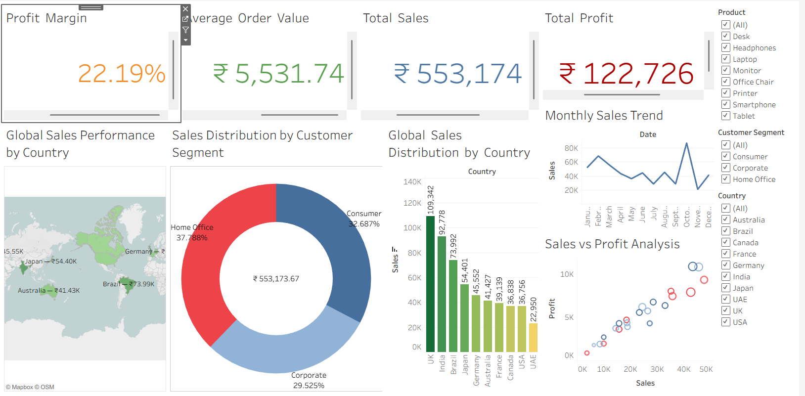
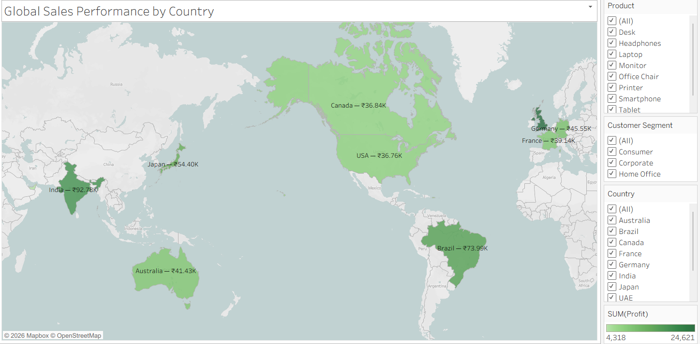
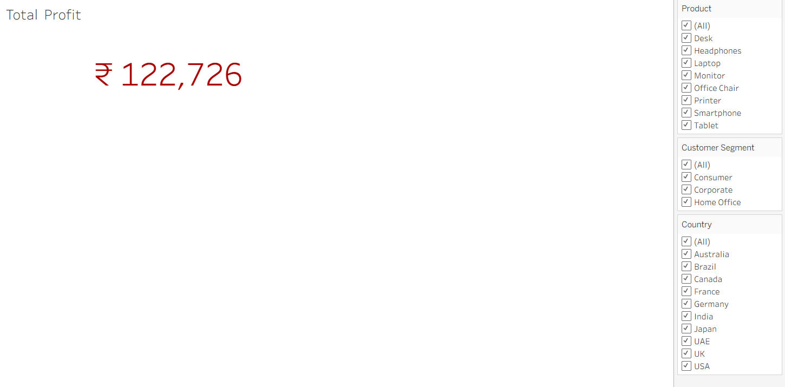
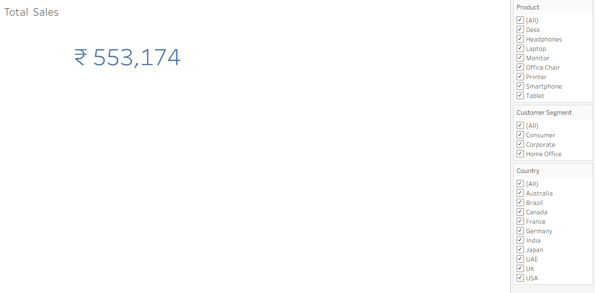

# 🌍 Global Sales Performance & Profitability Dashboard

## 📌 Project Overview
This project is an interactive Tableau dashboard designed to analyze global sales performance, profitability, customer segments, and regional business trends.

The dashboard helps businesses monitor KPIs such as Total Sales, Total Profit, Profit Margin %, and Average Order Value while providing insights into country-wise sales distribution and customer behavior.

---

# 🚀 Tools & Technologies Used

- Tableau
- Excel / CSV
- Data Visualization
- Business Intelligence
- Sales Analytics

---

# 📊 Dashboard Features

✅ KPI Cards  
✅ Global Sales Map  
✅ Monthly Sales Trend Analysis  
✅ Customer Segment Distribution  
✅ Country-wise Sales Distribution  
✅ Sales vs Profit Scatter Plot  
✅ Interactive Filters  

---

# 📈 Key KPIs

- Total Sales
- Total Profit
- Profit Margin %
- Average Order Value (AOV)

---

# 🌎 Business Insights

- Identified top-performing countries based on sales
- Compared profitability across regions
- Analyzed customer segment contribution
- Tracked monthly sales performance trends
- Evaluated relationship between sales and profit

---

# 📂 Project Structure

```bash
GLOBAL-SALES-PERFORMANCE-DASHBOARD/
│
├── dashboard/
│   └── Global_Sales_Dashboard.twbx
│
├── data/
│   └── global_sales_sample_dataset.xlsx
│
├── screenshots/
│   ├── dashboard_overview.png
│   ├── Sale_Distribution.png
│   ├── Sale_Performance.png
│   ├── Total_Profit.png
│   └── Total_Sales.png
│
└── README.md
```

---

# 🖼 Dashboard Screenshots

## 📌 Complete Dashboard Overview



---

## 📌 Global Sales Distribution


---

## 📌 Sales Performance Analysis



---

## 📌 Total Profit KPI



---

## 📌 Total Sales KPI



---

# 📁 Dataset

The dataset contains:
- Order Details
- Country
- Product Information
- Customer Segment
- Sales
- Profit
- Dates
- Shipping & Delivery Metrics

---

# 🎯 Objective

To build a professional business intelligence dashboard that helps organizations analyze:
- Sales performance
- Profitability
- Customer behavior
- Regional trends
- Business growth opportunities

---

# 🧠 Tableau Concepts Used

- Dimensions & Measures
- Calculated Fields
- Filters
- Interactive Dashboards
- Geographic Maps
- KPI Design
- Sorting & Aggregation
- Scatter Plots
- Donut Charts

---

# 📌 Conclusion

This project demonstrates practical Tableau dashboard development skills and business intelligence concepts used in real-world sales analytics and decision-making.

The dashboard is designed to help management teams make data-driven strategic decisions using interactive visualizations.

---

# 🔗 Author

Aneesha Varma
